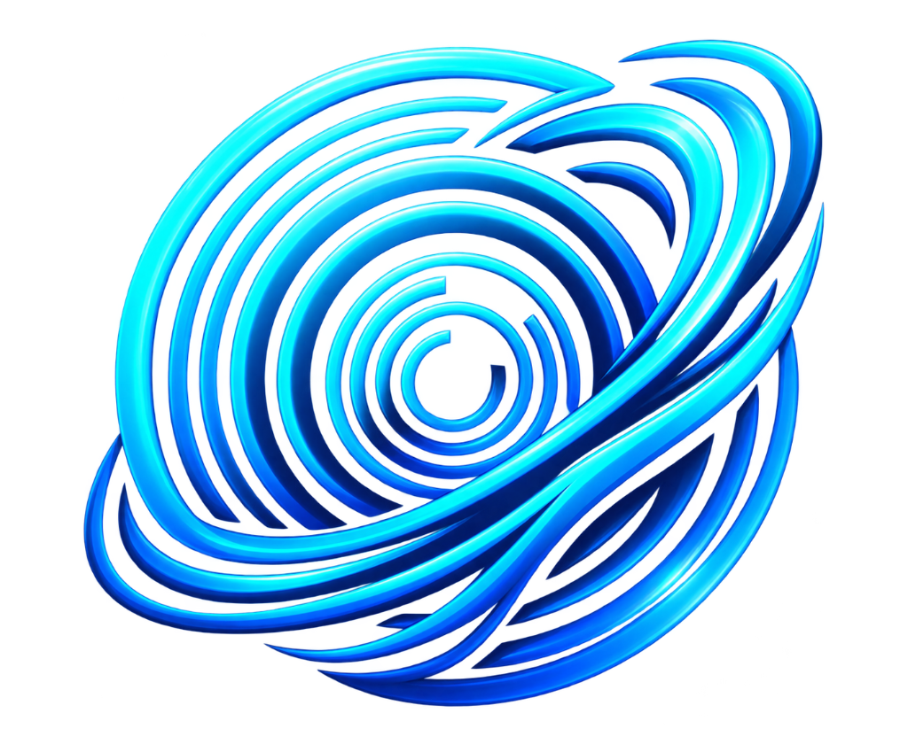

<div align="center">
  
  <h1>AETHERIS</h1>
  <p><strong>Next-Gen Geospatial Intelligence & Global Situational Awareness Platform</strong></p>
  <p><em>Nothing Out Of Sight</em></p>

  <p>
    <a href="https://vitejs.dev/"></a>
    <a href="https://cesium.com/"></a>
    <a href="https://deck.gl/"></a>
    <a href="https://threejs.org/"></a>
    <a href="LICENSE"></a>
  </p>
</div>

---

**AETHERIS** (*"Nothing Out Of Sight"*) is a next-generation, browser-based 3D/2D global situational awareness, geospatial intelligence (GEOINT), and tactical visualization platform. Built on CesiumJS, Deck.gl, and Three.js, it aggregates real-time live feeds, historical telemetry, and critical physical infrastructure across aerospace, maritime, terrestrial, crisis, and cyber domains into an interactive **Aetheris Dual-Rail UI**.

---

## 🌟 Key Highlights

- **Dual-Rail Aetheris Command Interface**:
  - **Left Rail (Intelligence & Data Layers)**: 48px compact quick-access strip expandable to a multi-category drawer featuring 40 real-time and static intelligence layers.
  - **Right Rail (Tactical Tools)**: 48px compact tool strip expandable to tactical analytic suites including Line of Sight, Viewshed, 3D Threat Domes, Interception Solvers, and Acoustic Ranges.
- **Multi-Domain Intelligence Ingestion**:
  - **Air & Space**: OpenSky Network (OAuth2 live commercial/military ADS-B), Starlink & Satellite TLE tracking via SGP4 propagation, Global Airport Hubs, Military Airbases.
  - **Maritime & Naval**: AIS vessel tracking, Global Seaports, Submarine Communications Cables, Undersea Sensor arrays.
  - **Terrestrial & Infrastructure**: Global Datacenters, Major Hydroelectric & Water Dams, Power Plants, Nuclear Facilities, International Border Crossings.
  - **Crisis & Conflict**: GDACS Global Disaster Alerts, NASA FIRMS Live Thermal Hotspots/Wildfires, USGS Real-Time Earthquakes, GDELT Global Event Data, ACLED Conflict Events.
  - **Cyber & Comms**: Internet Exchange Points (IXPs), Fiber Landing Stations, GPS Interference / GNSS Jamming anomalies.
- **High-Fidelity 3D Rendering & Photogrammetry**:
  - Google Photorealistic 3D Tiles, Cesium World Terrain, High-Resolution Satellite & Aerial Imagery, Vector Base Maps.
  - Dynamic Time Scrubbing, Sun Position & Day/Night Shadowing, Atmospheric Scattering, Weather Fog/Precipitation shaders.
- **Low-Latency Architecture**:
  - WebWorker telemetry parsers, chunked GeoJSON streaming, instanced mesh rendering, automated batching, and cache-assisted API proxying.

---

## 🚀 Quick Start

### Prerequisites
- **Node.js**: `v18.0.0` or higher
- **npm** or **pnpm**
- Modern WebGL2-compatible browser (Chrome, Edge, Firefox, Brave)

### Installation

1. **Clone the repository**:
   ```bash
   git clone https://github.com/Tarunkush0620/Aetheris.git
   cd Aetheris
   ```

2. **Install dependencies**:
   ```bash
   npm install
   ```

3. **Configure Environment Variables**:
   Copy `.env.example` to `.env` and provide your API keys:
   ```bash
   cp .env.example .env
   ```
   Edit `.env` with your credentials:
   ```env
   # Cesium Ion Access Token (Required for 3D Photorealistic Tiles & World Terrain)
   VITE_CESIUM_ION_TOKEN=your_cesium_ion_token_here

   # OpenSky Network (Live Flight Telemetry OAuth2)
   OPENSKY_CLIENT_ID=your_client_id
   OPENSKY_CLIENT_SECRET=your_client_secret
   OPENSKY_USERNAME=your_username
   OPENSKY_PASSWORD=your_password

   # NASA Earthdata / FIRMS (Thermal Hotspots)
   VITE_NASA_FIRMS_MAP_KEY=your_firms_key
   ```

4. **Start Development Server**:
   ```bash
   npm run dev
   ```
   Open your browser at `http://localhost:5173` (or the port indicated in terminal).

5. **Production Build**:
   ```bash
   npm run build
   npm run preview
   ```

---

## 📁 Repository Architecture

```text
aetheris/
├── dist/                      # Compiled production assets
├── public/                    # Static 3D models (GLTF/GLB), textures, sounds
├── src/
│   ├── components/            # UI Panels, Modals, Timeline, HUD elements
│   ├── data/                  # 40 Data layer providers, TLE catalogs, local GeoJSON
│   │   ├── aetherisLayerGroups.js # Layer categorization & metadata registry
│   │   └── local_data/        # Local fallback datasets (Cables, Dams, Ports, etc.)
│   ├── aetherisLayerPanel.js  # Left-rail Data Layer Drawer & Search Engine
│   ├── aetherisToolPanel.js   # Right-rail Tactical Tools Control Suite
│   ├── dataLayers.js          # Unified Data Layer Orchestration & Lifecycle Manager
│   ├── scene.js               # Cesium / Deck.gl / Three.js Core Viewport Engine
│   ├── main.js                # App entrypoint, state bootstrap & event loops
│   └── style.css              # Aetheris Tactical Dark Theme, Glassmorphism, Dual-Rail styles
├── .env                       # Local private API credentials
├── .env.example               # Template environment configuration
├── package.json               # Node packages & build scripts
└── vite.config.js             # Vite build & asset streaming config
```

---

## 🛰️ Intelligence Layers Directory

| Category | Layer Identifier | Data Source / Method | Refresh Interval |
| :--- | :--- | :--- | :--- |
| **Air & Space** | `flights` | OpenSky Network REST/OAuth2 Live ADS-B | 15s |
| | `satellites` | Celestrak TLE / SGP4 Orbital Propagator | Real-time Orbit |
| | `airports` | OurAirports Global GeoJSON DB | Static Cached |
| | `military_bases`| Defense Logistics Public Base Registry | Static Cached |
| **Maritime** | `ships` | Live AIS Telemetry Stream | 30s |
| | `seaports` | World Port Index / UN LOCODE | Static Cached |
| | `undersea_cables`| TeleGeography Submarine Cable Map | Static GeoJSON |
| **Terrestrial** | `datacenters` | Global Cloud & Colocation Registry | Static GeoJSON |
| | `power_plants` | Global Power Plant Database (WRI) | Static GeoJSON |
| | `dams` | Global Dam and Reservoir Database (GRANnD) | Static GeoJSON |
| | `nuclear` | IAEA PRIS Power Reactor Information System | Static GeoJSON |
| **Crisis** | `earthquakes` | USGS Earthquake Hazards Real-Time Feed | 60s |
| | `wildfires` | NASA FIRMS MODIS/VIIRS Active Fires | 5m |
| | `disasters` | GDACS Global Disaster Alert & Coordination | 2m |
| | `conflict_events`| GDELT 2.0 / ACLED Global Event Stream | 15m |
| **Cyber** | `ixp_nodes` | Packet Clearing House / PeeringDB | Static GeoJSON |
| | `gnss_interference`| GPS Jamming & ADS-B Anomaly Detection | 10m |

---

## 🧰 Tactical Tools Suite

1. **Line of Sight (LOS)**: Real-time raycasting against 3D terrain and city mesh structures with green/red visual occlusion profiles.
2. **Viewshed Analysis**: 360-degree radial visual field calculation for elevated observer positions.
3. **3D Threat Domes**: Hemispherical weapon engagement and radar coverage zones with adjustable radius, ceiling, and azimuth.
4. **Intercept Calculator**: Kinematic trajectory calculation computing time-to-intercept and rendezvous coordinates between moving targets.
5. **Flight Vector Predictor**: Extrapolates current speed, climb rate, and heading vector arcs into future airspace volumes.
6. **Acoustic / Sonar Coverage**: Calculates underwater acoustic detection zones based on bathymetric depth.
7. **Elevation Profiler**: Interactive elevation cross-section graph along user-drawn polyline routes.
8. **Density Heatmap**: GPU-accelerated spatial density visualizer for live aircraft and vessel clusters.

---

## 🛡️ License

This project is licensed under the [MIT License](LICENSE).
